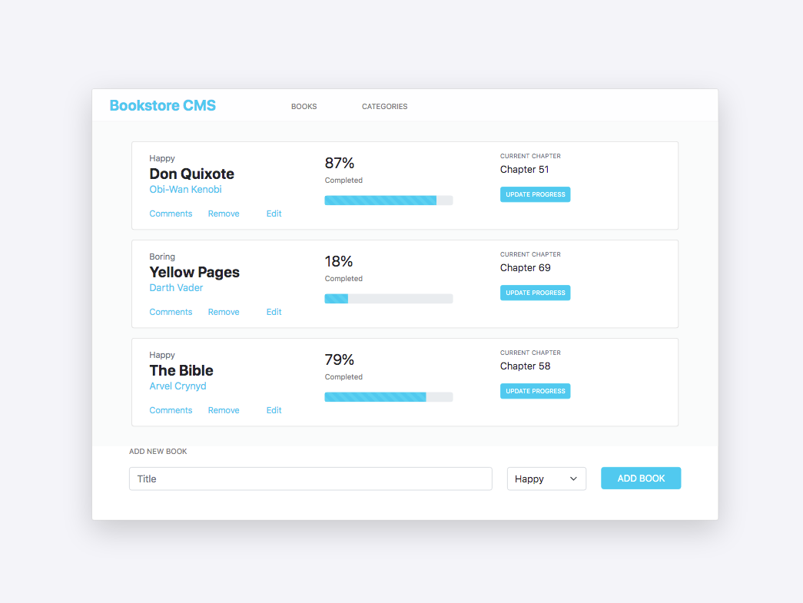

# bookstore-react-redux

> Welcome to my Bookstore React Redux App project, this is an interactive app excercise from Microverse.




## Built With

- React + Redux + Bootstrap

## Getting Started

* You will not need additional instructions on installing Prerequisites.
* In case you have node_modules on your folder Add them to .gitignore file before you a push.

### Prerequisites

* No prerequisites needed for this project.
### Installation

1. Clone the repo
   ```sh
   git clone git@github.com:smunozmo/bookstore-react-redux.git
   ```
2. Install NPM packages
   ```sh
   npm install
   ```
2. Run the app
   ```sh
   npm start
   ```

👤 **Author**

Sebastián Muñoz

- GitHub: [@smunozmo](https://github.com/smunozmo)
- Twitter: [@smunozmo](https://twitter.com/smunozmo)
- Linkedin: [Sebastián Muñoz](https://www.linkedin.com/in/smunozmo/)

## 🤝 Contributing

Contributions, issues, and feature requests are welcome!

Feel free to check the [issues page](https://github.com/smunozmo/bookstore-react-redux/issues).


## 👋 Acknowledgements

[Microverse](https://www.microverse.org). 

## Show your support

Give a ⭐️ if you like this project!
